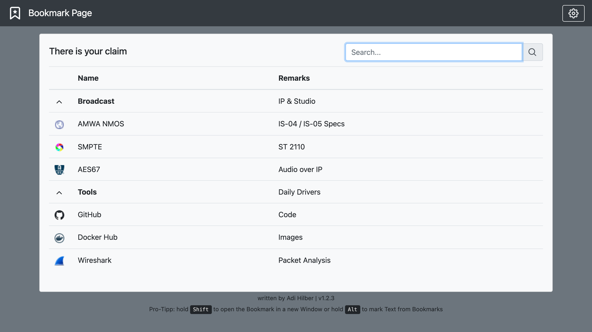
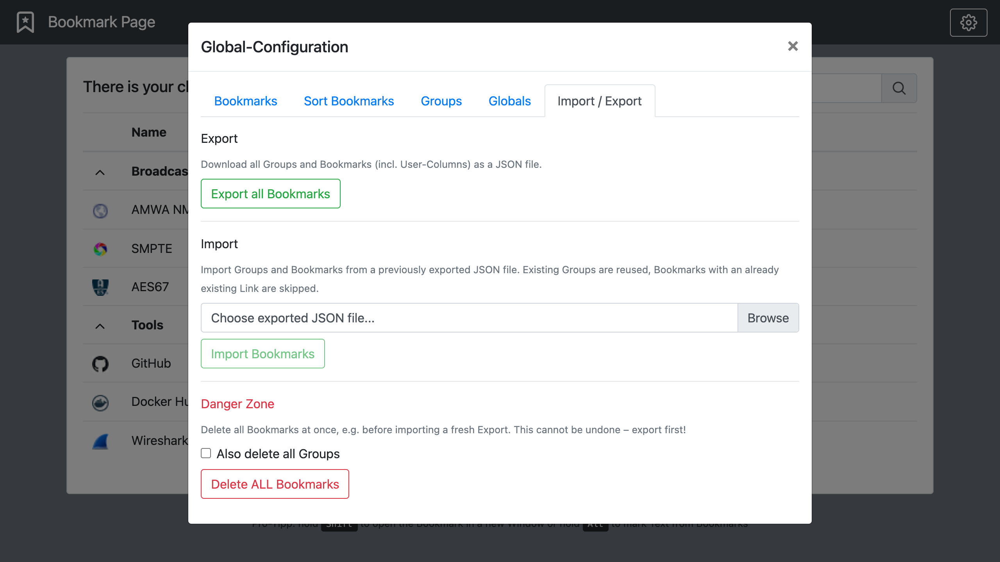

# Bookmark-Page

All-in-one Docker image (Apache/PHP 8.4 + MariaDB in a single container), built automatically
for linux/amd64 + linux/arm64 and published at https://hub.docker.com/r/gemini2350/bookmark-page



## Run it

```
docker run -d --name bookmark-page --restart unless-stopped -p 8080:80 -v bookmark-db:/var/lib/mysql gemini2350/bookmark-page:latest
```

then goto localhost:8080. enjoy...

The database is initialized automatically on first start and persisted in the
`bookmark-db` volume, so your bookmarks survive container restarts and image updates.
`--restart unless-stopped` brings the container back up after crashes and host reboots,
unless you stopped it yourself.

Update to a new version:

```
docker pull gemini2350/bookmark-page:latest && docker rm -f bookmark-page && docker run -d --name bookmark-page --restart unless-stopped -p 8080:80 -v bookmark-db:/var/lib/mysql gemini2350/bookmark-page:latest
```

Alternatively clone the Repo and use `docker compose up -d`.

## Features of this fork

- **Single container**: no separate MySQL container needed anymore
- **Updated stack**: `php:8.4-apache` base image with MariaDB
- **Import / Export**: new tab in the Global-Configuration modal
  - Export all Groups and Bookmarks (incl. User-Columns) as a JSON file
  - Import a previously exported JSON file: existing Groups are reused, Bookmarks whose
    Link already exists are skipped
  - Danger Zone: delete all Bookmarks (optionally incl. all Groups) at once
- **Group Variables**: each Group can define a Variable (Globals-Configuration → Groups tab).
  `{var}` in a Bookmark's Link or Favicon-URL is replaced by the Variable of the Group the
  Bookmark is in — e.g. Link `http://device.{var}/admin/` with Variable
  `gruppe1.example.com` opens `http://device.gruppe1.example.com/admin/`. The same Link
  (template) may exist in different Groups; duplicates are only blocked within one Group.
- **Configurable DB credentials** via environment variables:
  `DB_USER`, `DB_PASSWORD`, `DB_NAME` (sensible defaults built in)



## Migrating from the original Bookmark-Page

The original version has no export feature, but its API can be read. Use
[scripts/migrate-from-original.py](scripts/migrate-from-original.py) (Python 3, no
dependencies) to copy all Groups and Bookmarks over:

```
python3 scripts/migrate-from-original.py http://old-host:8080 http://new-host:8080
```

or write an `export.json` first and use the Import / Export tab in the new instance:

```
python3 scripts/migrate-from-original.py http://old-host:8080 > export.json
```

Bookmarks whose Link already exists in the new instance are skipped, so the script is
safe to run more than once.

## Development

build locally with `docker build -t bookmark-page .` and run it the same way as above.

## License

 Copyright 2020 Adrian Hilber
 Licensed under MIT (https://github.com/LeeO86/Bookmark-Page/blob/master/LICENSE)
